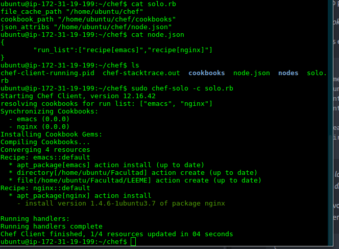
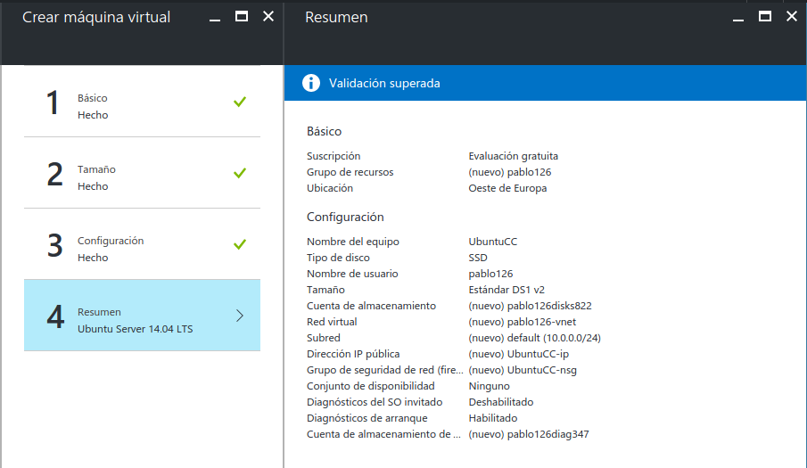
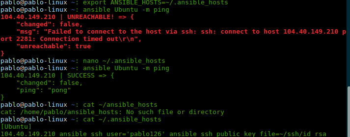
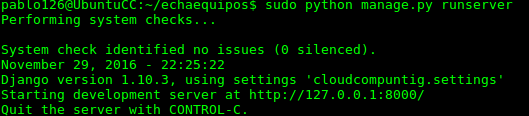

# Ejercicios tema 2 CC

>Autor: Juan Pablo González Casado

>Fecha: 25/11/2016

## Ejercicio 1
#### Instalar chef-solo en la máquiina virtual que vayamos a usar:

1. Creamos una cuenta en AWS.

2. Iniciamos Ubuntu Server 14 e instalamos Ruby
  ```
  sudo apt-get install ruby1.9.1 ruby1.9.1-dev rubygems
  ```

3. Instalamos chef de la manera mas rápida:

  *curl -L https://www.opscode.com/chef/install.sh | sudo bash*

4. Creamos el directorio para la receta de emacs

  *mkdir -p chef/cookbooks/emacs/recipes*

5. Dentro de el creamos el archivo *default.rb* con el siguiente contenido:

  ```
  package 'emacs'
  directory '/home/ubuntu/Facultad'
  file "/home/ubuntu/Facultad/LEEME" do
  	owner "ubuntu"
  	group "ubuntu"
  	mode 00544
  	action :create
  	content "Directorio para documentos de la facultad"
  end
  ```
  *Este archivo contiene la receta para instalar emacs, crear un directorio y crear un archivo dentro del directorio.*

6. Dentro del directorio de chef creamos el archivo *node.json*, que contendrá una refrencia a la receta anterior.

  ```
  {
	"run_list": [ "recipe[emacs]" ]
  }
  ```
7. También creamos el archivo *solo.rb*:

  ```
  file_cache_path "/home/ubuntu/chef"
  cookbook_path "/home/ubuntu/chef/cookbooks"
  json_attribs "/home/ubuntu/chef/node.json"
  ```
8. Finalmente ejecutamos:

  ```
  sudo chef-solo -c solo.rb
  ```

## Ejercicio 2
#### Crear una receta para instalar nginx, tu editor favorito y algún directorio y fichero que uses de forma habitual.

1. Creamos el directorio para la receta de nginx

  *mkdir -p chef/cookbooks/nginx/recipes*

2. Dentro de el creamos el archivo *default.rb* con el siguiente contenido:

    ```
    package 'nginx'
    directory '/home/ubuntu/Facultad/ejercicio2'
    file "/home/ubuntu/Facultad/ejericio2/LEEME" do
    	owner "ubuntu"
    	group "ubuntu"
    	mode 00544
    	action :create
    	content "Directorio para ejercicio2"
    end
    ```
    *Este archivo contiene la receta para instalar nginx, crear un directorio y crear un archivo dentro del directorio.*

3. Modificamos el archivo *node.json* creado previamente para el ejecicio 1, dejandolo de la siguiente forma:

  ```
  {
	"run_list": [ "recipe[emacs]","recipe[nginx]" ]
  }
  ```
4. Ejecutamos

  ```
  sudo chef-solo -c solo.rb
  ```
  *Resultado*:


## Ejercicio 3

#### Escribir en YAML la siguiente estructura de datos en JSON: { uno: "dos", tres: [ 4, 5, "Seis", { siete: 8, nueve: [ 10, 11 ] } ] }

```
---
uno: "dos"
tres:
  - 4
  - 5
  - "Seis"
  - siete: 8
    nueve:
      - 10
      - 11
```

## Ejercicio 5

#### Desplegar los fuentes de una aplicación cualquiera, propia o libre, que se encuentre en un servidor git público en la máquina virtual Azure (o una máquina virtual local) usando ansible.

1. Creamos nuestra máquina virtual en Azure

  *Creando máquina virtual en Azure*:
  

2. Instalamos Ansible en nuestro sistema local:

  ```
  sudo pip install paramiko PyYAML jinja2 httplib2 ansible
  ```

3. Creamos el fichero ~/.ansible_host:
  ```
  [Ubuntu]
  104.40.149.210 ansible_ssh_user='pablo126' ansible_ssh_public_key_file=~/ssh/id_rsa
  ```

4. Añadimos la variable de entorno de ansible:
  ```
  export ANSIBLE_HOST=~/.ansible_hosts
  ```
5. Comprobamos que todo esta correcto, realizando un ping a la máquina virtual:

  *Comprobando configuración Ansible*:
  

6. Instalamos las dependencias que necesitemos:

  ```
  ansible Ubuntu -m command -a "sudo apt-get update"
  ansible Ubuntu -m command -a "sudo apt-get install python-pip"
  ansible Ubuntu -m command -a "sudo pip install django"
  ansible Ubuntu -m command -a "sudo apt-get --assume-yes install git"
  ```

7. Descargamos el repositorio de echaequipos
  ```
  ansible Ubuntu -m git -a
   "repo=https://github.com/Pablo126/echaequipos.git
    dest=~/echaequipos version=HEAD"
  ```
8. Ejecutamos la aplicación y comprobamos que corre en el servidor.

  *Ejecutndo echaequipos en azure*:
  
