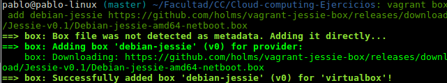
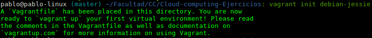
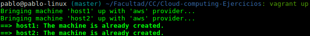
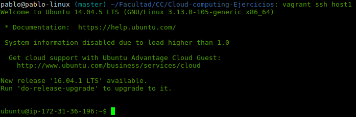

# Ejercicios Orquestació

>Autor: Juan Pablo González Casado

### Ejercicio 1
Instalar una máquina virtual Debian usando Vagrant y conectar con ella.

*Instalando debian con vagrant*:

*Iniciando las máquinas con Vagrant*:

*Arrancamos las máquinas*:

*Conectamos con ssh*:

### Ejercicio 4
Configurar tu máquina virtual usando `vagrant` con el provisionador
ansible
