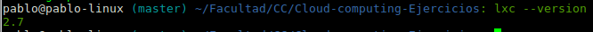
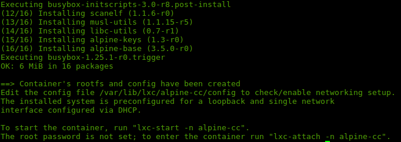
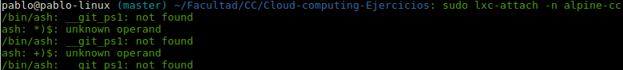
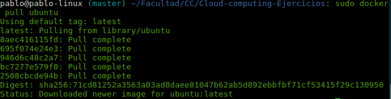
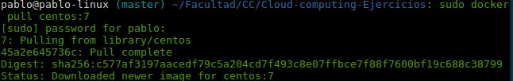
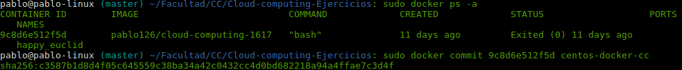

# Ejercicios tema 5

>Autor:Juan Pablo González Casado

### Ejercicio 1
Instala LXC en tu versión de Linux favorita. Normalmente la versión en desarrollo, disponible tanto en GitHub como en el sitio web está bastante más avanzada; para evitar problemas sobre todo con las herramientas que vamos a ver más adelante, conviene que te instales la última versión y si es posible una igual o mayor a la 2.0.

```
sudo add-apt-repository ppa:ubuntu-lxc/lxc-lts
sudo apt-get update
sudo apt-get install lxc
sudo apt install lxd
```
*Instalamos lxc*:


### Ejercicio 2
Instalar una distro tal como Alpine y conectarse a ella usando el nombre de usuario y clave que indicará en su creación.

```
sudo apt-get install lxc-templates
sudo lxc-create -t alpine -n alpine-cc
```
*Creamos alpine*:


```
sudo lxc-start -n alpine-cc
sudo lxc-attach -n alpine-cc
```
*Creamos alpine*:


Da fallo, ya que lxc usa ash.

### Ejercicio 4
Con docker ya instalado:
*Instamos ubuntu*:


Con docker ya instalado:
*Instamos centos*:

### Ejercicio 5
Buscamos el ID y hacemos el commit
*Commit de centos*:

